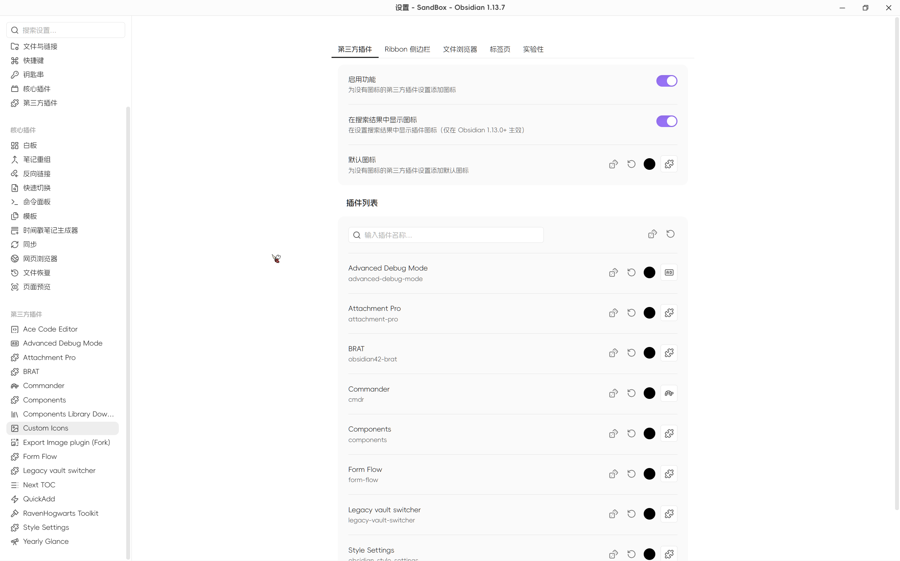

中文 | [English](https://github.com/Raven-Pensieve/obsidian-custom-icons/blob/master/README.md)

# 自定义图标

为文件与文件夹、标签页、Ribbon 侧边栏、第三方插件设置等提供全方位的自定义图标，增强您的工作空间美观及易用性。

## 功能特性

自 v2.5 起，v1.0 的重制已全部完成：1.0 之前的经典功能（侧边栏/Ribbon、文件夹与文件图标）均已通过原生方式重新实现，插件不再生成 CSS 片段。

### 图标定制范围

- **第三方插件图标** —— 为没有图标的第三方插件设置项添加图标（修复 Obsidian 1.11+ 的问题）；支持默认图标与随机图标（可单个或全部随机）；可在设置搜索结果中显示图标（需 Obsidian 1.13+）。
- **Ribbon 侧边栏图标** —— 自定义左侧 Ribbon 按钮的图标（按提示文本识别），可随时恢复原始图标。
- **文件浏览器图标** —— 为文件夹和文件显示图标，逐项解析、级联生效：
  - 文件夹默认图标与文件兜底图标（留空则不显示）；
  - 按扩展名统一分配，支持批量添加；复合后缀优先（如 `excalidraw.md` 优先于 `md`）；
  - 在文件树中右键「设置图标 / 重置图标」可单独指定；
  - 可选继承：子文件夹、以及未匹配扩展名规则的子文件，自动沿用最近祖先文件夹的图标（含颜色）；
  - 重命名自动迁移配置，删除自动清理。
- **标签页图标** —— 自定义工作区标签页头（侧栏工具页与编辑器标签，含弹出窗口），两级解析：单标签覆盖优先、按视图类型映射兜底、其余保留原生（原生图标仅隐藏不删除，禁用后自动恢复）。右键已激活的标签页即可设置或重置图标。

### 自定义图标库

通过 Ribbon 按钮或命令 **「自定义图标：打开自定义图标库」** 打开。

- **自定义 SVG 图标** —— 粘贴 SVG 源码或上传 `.svg` 文件（支持批量上传，文件名即图标 ID）。
- **图标库** —— 从内置 [Iconify](https://iconify.design) 目录（220+ 图标集）一键安装整套图标，或从任意以散装 SVG 发布的 npm 包导入（支持路径 glob，附常用包一键安装）。安装前可预览；支持启用/停用、重新下载、卸载。图标存储在本地，安装后完全离线可用。
- **Lucide 浏览** —— 浏览插件内置的全部 Lucide 图标，并筛选出 Obsidian 原生未包含的扩展图标。

图标库中的图标会以 `CI-` 前缀注册为普通的 Obsidian 全局图标，即时生效，任何插件都可以使用（见常见问题）。

### 实验性功能

- **始终最先加载本插件** —— 自动把本插件保持在社区插件加载顺序最前，避免其他插件因加载顺序而图标空白。仅调整顺序、不增删条目；下次启动生效。

## 使用

图标在两处配置：

- **设置 → 自定义图标** —— 每个界面一个标签页（第三方插件、Ribbon、文件浏览器、标签页），另有实验性选项。
- **就地设置** —— 在文件浏览器中右键文件/文件夹，或右键已激活的标签页头，即可设置或重置图标。

若图标显示异常，可在命令面板执行 **「自定义图标：重新应用所有图标」**，重新注册并重应用全部图标。

## 安装方法
### 社区插件市场安装

[点击安装](obsidian://show-plugin?id=custom-sidebar-icons)，或按以下步骤操作：

1. 打开 Obsidian 并前往 `设置 > 第三方插件`。
2. 搜索 “Custom Icons”。
3. 点击 “安装”。

### BRAT（推荐给测试用户）

1. 安装 [BRAT](https://github.com/TfTHacker/obsidian42-brat) 插件
2. 在 BRAT 设置中点击“添加测试插件”
3. 输入 `Raven-Pensieve/obsidian-custom-icons`
4. 启用插件

## 从 0.x 升级

v1.0 为破坏性的全面重制，v2.x 已将 1.0 之前的经典功能以原生方式全部实现。旧的 CSS 配置方式——包括自动生成的 `CustomIcon-AutoGen` CSS 片段——不再使用、也不会迁移。升级后请从仓库中手动删除该片段，并在新设置页中重新配置图标。

## 常见问题

### 其他插件能使用我的自定义 SVG 图标吗？

可以。图标库中的图标会以 `CI-<图标ID>` 的形式注册为**普通的 Obsidian 全局图标**，任何插件都可以通过 `setIcon(el, "CI-my-icon")` 使用；**新增 SVG 即时生效，无需重载 Obsidian**。

### 其他插件里我的图标显示空白？

Obsidian 的 `setIcon` 是一次性渲染：若该插件在「自定义图标」加载**之前**就已渲染该图标（插件加载顺序因人而异），该位置会空白。请依次尝试：

1. 执行命令 **「自定义图标：重新应用所有图标」**（刷新本插件管理的界面图标）；
2. 重新打开对应界面 / 面板；
3. 开启 **设置 → 实验性 →「始终最先加载本插件」** 并重启（见下文，根治方案）；
4. 重载该插件，或重启 Obsidian。

**进阶：让本插件始终最先加载。** 社区插件按 `.obsidian/community-plugins.json` 中的**数组顺序**依次加载。把 `"custom-sidebar-icons"` 移到数组最前面并重启 Obsidian，本插件会先于其他插件完成图标注册，可彻底避免 Ribbon 图标等启动期一次成型的界面出现空白。也可在 **本插件设置 → 实验性** 中开启 **「始终最先加载本插件」**——每次本插件加载时自动修正数组顺序（仅调整顺序、不增删条目，下次启动生效；实验性）。注意：手动调整顺序时勿删条目；新装/启用插件后该数组可能被重写；Ribbon 按钮也可在本插件设置 → Ribbon 侧边栏 中直接分配图标。

## 许可证

此项目基于 GPL-3.0 许可 - 详情请参阅 [LICENSE](LICENSE) 文件。

## Star 历史

## 鸣谢

- [obsidian-metadata-icon](https://github.com/Benature/obsidian-metadata-icon)
- [Templater](https://github.com/SilentVoid13/Templater)
