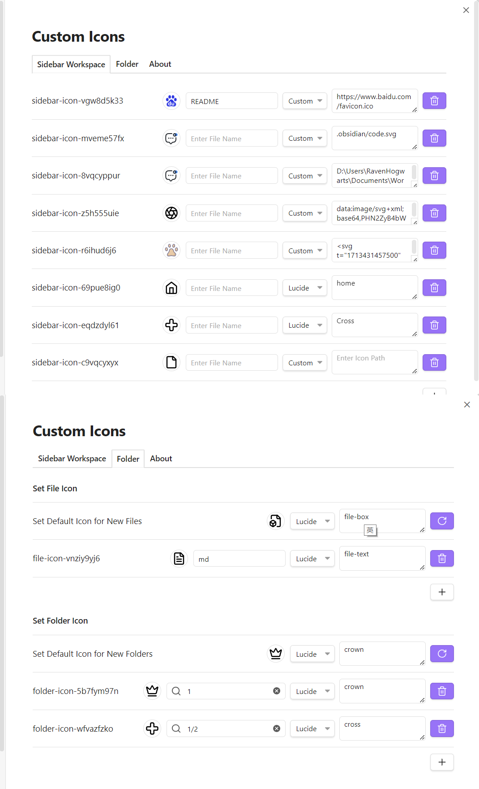

# Custom Icons

Enhance your workspace with customizable icons for documents and folders.

Tips: 插件安装后需要重新启动当前Obsidian库才能加载到设置数据。

Tips: After installing the plugin, you need to restart the current Obsidian vault to load the setting data.

[中文](https://github.com/RavenHogWarts/obsidian-custom-icons/blob/master/README_ZH.md) | [English](README.md)

## Usage

Currently, there are two ways to set the icons:

- Custom: This includes using online URLs, local relative or absolute file paths, Base64 encodings, or SVG tags.
- Lucide icons: This method requires only the name of the icon from [Lucide](https://lucide.dev/icons/). Note that the official Obsidian icons also use Lucide icons.

### Examples

- Online URL: `https://www.example.com/favicon.ico`
- Local images:
  - Relative path: `.obsidian/svg/example.svg`
  - Absolute path (Unix-style): `/Users/YourUsername/Pictures/example.jpg`
  - Absolute path (Windows-style): `D:\Pictures\example.png`
- Base64 encoding: Starting with `data:`
- SVG tags: Enclosed within `<svg></svg>` tags
- Lucide source icons: Directly use the icon name from Lucide.

## Installation

### Install from Community Plugins

[Click to install](obsidian://show-plugin?id=custom-sidebar-icons), or:

1. Open Obsidian and go to `Settings > Community Plugins`.
2. Search for "Custom Icons".
3. Click "Install".

### Install via BRAT Plugin

1. Install the [BRAT plugin](obsidian://show-plugin?id=obsidian42-brat) from Community Plugins.
2. In the BRAT plugin settings, click "Add Beta Plugin".
3. Enter the URL `https://github.com/RavenHogWarts/obsidian-custom-icons`.
4. Enable "Custom Icons" in "Third-party Plugins".

### Manual Installation

1. Download the latest release from [Releases](https://github.com/RavenHogWarts/obsidian-custom-icons/releases/latest).
2. Copy `main.js`, `styles.css` and `manifest.json` to `VaultFolder/.obsidian/plugins/custom-sidebar-icons/`.
3. Reload plugins and enable "Custom Icons" in "Third-party Plugins".

## How to Build

1. Clone the repository: `git clone https://github.com/RavenHogWarts/obsidian-custom-icons`.
2. Install dependencies: `npm install`.
3. Start development: `npm run dev`.
4. Build for production: `npm run build`.

## License

[Custom Icons](https://github.com/RavenHogWarts/obsidian-custom-icons) is licensed under the MIT License. See [LICENSE](https://github.com/RavenHogWarts/obsidian-custom-icons/blob/master/LICENSE) for more information.

## Acknowledgements

- [obsidian-metadata-icon](https://github.com/Benature/obsidian-metadata-icon)
- [Templater](https://github.com/SilentVoid13/Templater)

## Support

If you find this plugin useful and wish to support its development, you can do so through the following methods: WeChat, Alipay, [Love Power Donation](https://afdian.net/a/ravenhogwarts) or [Paypal](https://www.paypal.com/paypalme/RavenHogwarts). Any amount of support is appreciated. Thank you!

