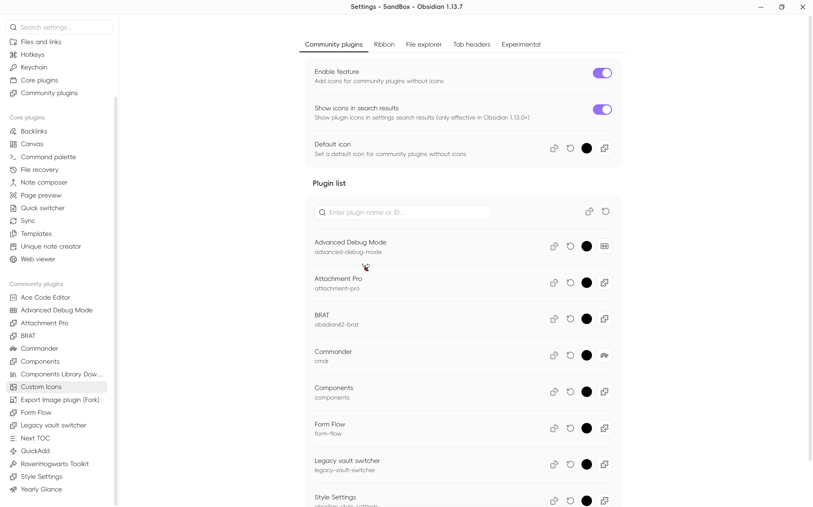

English | [中文](https://github.com/Raven-Pensieve/obsidian-custom-icons/blob/master/README.ZH.md)

# Custom Icons

Enhance your workspace with customizable icons — files & folders, tab headers, ribbon actions, community plugins and more.

## Features

Since v2.x, the v1.0 remaster is complete: the classic pre-1.0 features (sidebar/ribbon, folder and file icons) are all reimplemented natively — the plugin no longer generates CSS snippets.

### Icon surfaces

- **Community plugin icons** — add icons to community plugins without one (fix for Obsidian 1.11+), assign a default or random icon (per plugin or all at once), and show icons in the settings search results (Obsidian 1.13+).
- **Ribbon icons** — customize the icons of the left ribbon actions (identified by tooltip text), and restore the originals at any time.
- **File explorer icons** — icons for folders and files, resolved per item with cascading rules:
  - a default folder icon and a fallback file icon (leave empty to hide icons);
  - per-extension rules with batch add; compound suffixes take precedence (`excalidraw.md` over `md`);
  - per-item overrides via right-click → "Set icon" / "Reset icon" directly in the file tree;
  - optional inheritance: subfolders, and files matching no extension rule, follow the nearest ancestor folder's icon (color included);
  - overrides follow renames and are cleaned up on deletion automatically.
- **Tab header icons** — customize workspace tab headers (sidebar tool tabs and editor tabs, popout windows included) with two-level resolution: per-tab overrides take priority, a per-view-type mapping acts as fallback, native icons are kept otherwise (hidden, not removed — restored automatically when disabled). Right-click an active tab to set or reset its icon.

### Custom icon library

Open it from the ribbon button or via the command **"Custom Icons: Open custom icon library"**.

- **Custom SVG icons** — paste SVG code or upload `.svg` files (batch upload supported; file names become icon IDs).
- **Icon packs** — install whole icon sets from the built-in [Iconify](https://iconify.design) catalog (220+ sets) or from any npm package shipping loose SVG files (path globs supported, popular presets included). Preview before installing; enable/disable, re-download or uninstall at any time. Packs are stored locally and work fully offline after installation.
- **Lucide browser** — browse all Lucide icons bundled with the plugin, with a filter separating icons already built into Obsidian from the extras.

All library icons are registered as regular Obsidian global icons (prefixed `CI-`), take effect immediately, and can be used by any other plugin (see FAQ).

### Experimental

- **Always load this plugin first** — automatically keeps this plugin at the front of the community plugin load order, so icons never go missing because of load order. Reorders only, never adds or removes entries; takes effect on the next restart.

## Usage

Icons are configured in two places:

- **Settings → Custom Icons** — one tab per surface (community plugins, ribbon, file explorer, tab headers) plus experimental options.
- **In place** — right-click a file/folder in the file explorer, or an active tab header, to set or reset its icon.

If icons ever look wrong, run **"Custom Icons: Reapply all icons"** from the command palette to re-register and reapply everything.

## Installation
### Community plugin market installation

[Click to install](obsidian://show-plugin?id=custom-sidebar-icons), or:

1. Open Obsidian and go to `Settings > Community Plugins`.
2. Search for "Custom Icons".
3. Click "Install".

### BRAT (Recommended for Beta Users)

1. Install [BRAT](https://github.com/TfTHacker/obsidian42-brat) plugin
2. Click "Add Beta plugin" in BRAT settings
3. Enter `Raven-Pensieve/obsidian-custom-icons`
4. Enable the plugin

## Upgrading from 0.x

v1.0 was a breaking remaster and v2.x has brought the classic pre-1.0 features back with native implementations. The old CSS-based configuration — including the auto-generated `CustomIcon-AutoGen` CSS snippet — is no longer used or migrated. After upgrading, remove that snippet from your vault and set your icons up again in the new settings page.

## FAQ

### Can other plugins use my custom SVG icons?

Yes. Library icons are registered as **regular Obsidian global icons** with the id `CI-<icon-id>`. Any plugin can render them with `setIcon(el, "CI-my-icon")`, and newly added SVGs take effect **immediately — no app reload required**.

### My icon shows blank inside another plugin?

Obsidian's `setIcon` is a one-shot render: if that plugin rendered the icon **before** Custom Icons was loaded (plugin load order varies by user), the spot stays blank. Try in order:

1. Run the command **"Custom Icons: Reapply all icons"** (refreshes icons on surfaces managed by this plugin);
2. Reopen the affected view / panel;
3. Enable **Settings → Experimental → "Always load this plugin first"** and restart (see below — the root fix);
4. Reload that plugin, or restart Obsidian.

**Advanced: always load this plugin first.** Community plugins load in the order of the array in `.obsidian/community-plugins.json`. Moving `"custom-sidebar-icons"` to the front of the array (then restarting Obsidian) makes it register icons before any other plugin loads — completely avoiding blank icons on one-shot surfaces such as ribbon actions. Or enable **"Always load this plugin first"** under **Settings → Experimental** of this plugin — it automatically re-enforces the front position whenever the plugin loads (reorders only, never adds/removes entries; takes effect on next restart; experimental). Note: when reordering manually, never remove entries; enabling new plugins may rewrite the array. Ribbon actions can also be assigned icons directly in Settings → Ribbon of this plugin.

## License

This project is licensed under the GPL-3.0 license - see the [LICENSE](LICENSE) file for details.

## Star History

## Acknowledgements

- [obsidian-metadata-icon](https://github.com/Benature/obsidian-metadata-icon)
- [Templater](https://github.com/SilentVoid13/Templater)
