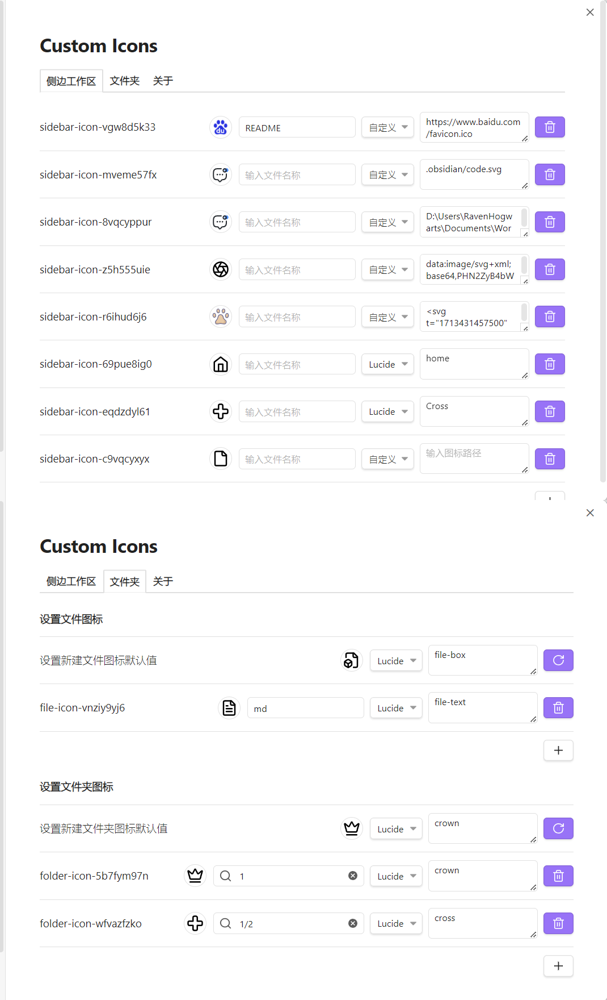

# 自定义图标

通过为文档和文件夹设置可自定义的图标，增强您的工作空间美观及易用性。

[中文](README_ZH.md) | [English](https://github.com/RavenHogWarts/obsidian-custom-icons/blob/master/README.md)

## 使用方法

目前，有两种设置图标的方法：
- 自定义：包括使用在线 URL、本地相对（绝对）文件路径、Base64 编码或 SVG 标签。
- Lucide 图标：此方法仅需从 [Lucide](https://lucide.dev/icons/) 获取图标名称。值得注意的是，官方图标也使用 Lucide 图标。

### 示例

- 在线 URL：`https://www.example.com/favicon.ico`
- 本地图片：
  - 相对路径：`.obsidian/svg/example.svg`
  - 绝对路径（Unix 风格）：`/Users/YourUsername/Pictures/example.jpg`
  - 绝对路径（Windows 风格）：`D:\Pictures\example.png`
- Base64 编码：以 `data:` 开头
- SVG 标签：包裹在 `<svg></svg>` 标签内
- Lucide 源图标：直接使用来自 Lucide 的图标名称。

## 安装方法

### 从社区插件安装

[点击安装](obsidian://show-plugin?id=custom-sidebar-icons)，或按以下步骤操作：

1. 打开 Obsidian 并前往 `设置 > 第三方插件`。
2. 搜索 “Custom Icons”。
3. 点击 “安装”。

### 通过 BRAT 插件安装

1. 从社区插件中安装 [BRAT 插件](obsidian://show-plugin?id=obsidian42-brat)。
2. 在 BRAT 插件设置中，点击 "Add Beta Plugin"。
3. 输入 URL `https://github.com/RavenHogWarts/obsidian-custom-icons`。
4. 在 “第三方插件” 中启用 “Custom Icons”。

### 手动安装

1. 从 [发布页面](https://github.com/RavenHogWarts/obsidian-custom-icons/releases/latest) 下载最新发布版本。
2. 复制 `main.js`，`styles.css` 和 `manifest.json` 到您的仓库文件夹 `VaultFolder/.obsidian/plugins/custom-sidebar-icons/`。
3. 重新加载插件并在 “第三方插件” 中启用 “Custom Icons”。

## 如何构建

1. 克隆仓库：`git clone https://github.com/RavenHogWarts/obsidian-custom-icons`。
2. 安装依赖：`npm install`。
3. 开始开发：`npm run dev`。
4. 为生产环境构建：`npm run build`。

## 许可证

[Custom Icons](https://github.com/RavenHogWarts/obsidian-custom-icons) 采用 MIT 许可证。更多信息请查看 [LICENSE](https://github.com/RavenHogWarts/obsidian-custom-icons/blob/master/LICENSE)。

## 鸣谢

- [obsidian-metadata-icon](https://github.com/Benature/obsidian-metadata-icon)
- [Templater](https://github.com/SilentVoid13/Templater)

## 支持

如果您觉得这个插件有用，并希望支持其开发，您可以通过以下方式赞助我：微信，支付宝。感谢您的任何支持！

