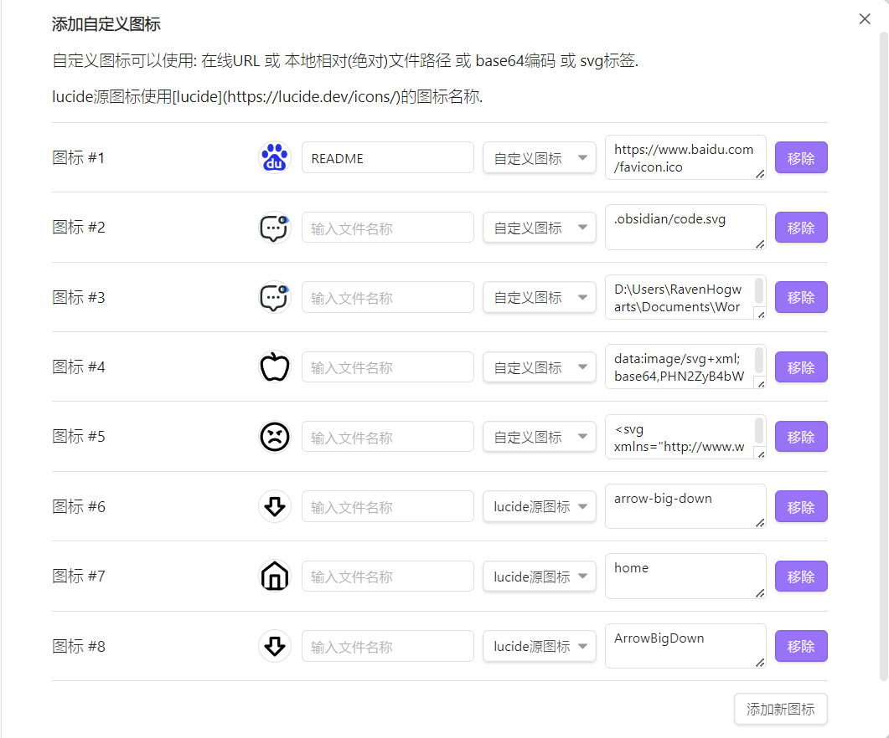

# Custom Sidebar Icons

定制侧边栏工作区文件和文件夹图标，个性化您的 Obsidian 体验。

   
 

[ 中文 | [English](https://github.com/RavenHogWarts/obsidian-custom-sidebar-icons/blob/master/README.md) ]

这款插件让你可以为Obsidian侧边栏中的固定文件自定义图标，使你的工作空间更个性化，也更易于导航。

## 使用

目前图标的设置分为两种方式,一种是自定义,一种是lucide源图标
- 自定义
  - 自定义包括了使用在线URL、本地相对(绝对)文件路径、base64编码、svg标签
- lucide图标
  - 这种方法只需要输入在[lucide](https://lucide.dev/icons/)得到的图标名称
  - 重要的是官方的图标使用的也是lucide的图标

### 示例
- 在线URL
  - 如：`https://www.baidu.com/favicon.ico`
- 本地图片
  - 相对路径：`.obsidian/svg/RavenHogwarts.svg`
  - 绝对路径（类Unix风格）：`/Users/RavenHogwarts/Pictures/RavenHogwarts.jpg`
  - 绝对路径（Windows风格）：`D:\RavenHogwarts.png`,`D:/RavenHogwarts.png`
- base64编码
  - 以`data:`开头
- svg标签
  - 被`<svg></svg>`标签包裹
- lucide源图标
  - [lucide](https://lucide.dev/icons/)的icon名称

## 支持

如果你觉得这个插件对你有用，并且想支持它的发展，你可以通过以下方式赞助我：微信，支付宝或[爱发电](https://afdian.net/a/ravenhogwarts)。任何金额都是受欢迎的，谢谢你！

## 安装

### 从插件社区安装

[点击安装](https://obsidian.md/plugins?id=custom-sidebar-icons)，或者：

- 打开Obsidian，进入 设置 > 社区插件
- 搜索 `Custom Sidebar Icons`
- 点击 `安装`

### 通过 [BRAT 插件](https://obsidian.md/plugins?id=obsidian42-brat) 安装

- 首先安装 [BRAT 插件](https://obsidian.md/plugins?id=obsidian42-brat)：
- 在BRAT插件中，点击 `Add Beta plugin`
- 输入 https://github.com/RavenHogWarts/obsidian-custom-sidebar-icons
- 在 `第三方插件` 中启用 `Custom Sidebar Icons`

### 手动安装

- 在 [发布页面](https://github.com/RavenHogWarts/obsidian-custom-sidebar-icons/releases/latest)下载最新版本
- 复制 `main.js`，`manifest.json` 到你的库 `VaultFolder/.obsidian/plugins/custom-sidebar-icons/`
- 重新加载插件，在 `第三方插件` 中启用 `Custom Sidebar Icons`

## 如何构建

- `git clone https://github.com/RavenHogWarts/obsidian-custom-sidebar-icons` 克隆这个仓库。
- `npm i`  安装依赖。
- `npm run dev` 开启实时编译。
- `npm run build` 构建生产版本。

## 鸣谢

在开发`Custom Sidebar Icons`插件的过程中，我借鉴并使用了[Benature](https://github.com/Benature)的[obsidian-metadata-icon](https://github.com/Benature/obsidian-metadata-icon)项目中的一些灵感和代码构建。我要特别感谢这个项目及其贡献者们对于开源社区的贡献，他的工作极大地促进了Obsidian插件生态系的发展。如果你也对他的项目感兴趣，请支持和关注[obsidian-metadata-icon](https://github.com/Benature/obsidian-metadata-icon)。
